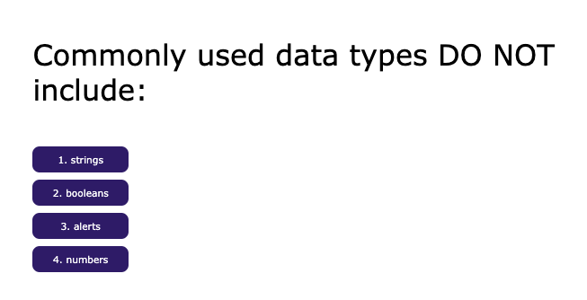

# Web APIs Challenge | Code Quiz
Lesson 4 Weekly Challenge | Interactive Quiz

## Student Name
Tara Brichetto

## Creation Date
22 August 2020

## Purpose
This coding quiz was created as the Week 4 Challenge Assignment for the University of Arizona's coding bootcamp program.

## Project Requirements
*Timed multiple-choice quiz on Javascript fundamentals  
*Stores high scores using localStorage  
*When user answers a question, he/she is presented with another question  
*When user answers a question incorrectly, time is subtracted from the clock  
*Quiz is over when user answers all questions or the timer reaches 0  
*User can save initials and quiz score  

## Built With
*HTML  
*CSS  
*JavaScript  

## Website
* Github Repository | https://github.com/tbrichet/code-quiz  
* Deployed Application |  https://tbrichet.github.io/code-quiz

## Contributions
Made with <3 by Tara Brichetto

## Screenshot
